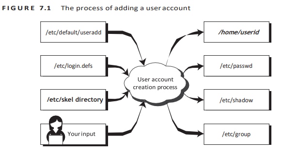

# Managing Users and Groups

### Understanding Users and Groups

DAC là kiểm soát bảo mật truyền thống của linux, trong đó quyền truy cập vào tệp hoặc bất kỳ đối tượng nào, dựa trên danh tính của người dùng và tư cách thành viên nhóm hiện tại. 

Khi tài khoản người dùng được tạo, tài khoản đó sẽ được cấp tư cách thành viên cho 1 nhóm cụ thể, được gọi là nhóm mặc định của tài khoản. 

### Configuring User Accounts

Để thêm 1 tài khoản mới, ta sử dụng lệnh `useradd` 



#### The /etc/login.defs File

Cung cập thông tin cấu hình mặc định cho 1 số thông số tài khoản người dùng. Các lệnh `useradd`, `userdel`, `groupadd` cũng như các tiện ích nhóm và người dùng khác nhận các giá trị mặc định từ tệp này. 

Một phần cấu hình của `/etc/login.defs`:

- Vị trí của emails người dùng
- Kiểm soát lão hóa mất khẩu
- Giá trị tối thiểu và tối đa cho lựa chọn UID tự động 
- Giá trị tối thiểu và tối đa cho GID tự động 
- Có nên tạo thư mục chính khi thêm người dùng mới hay không
- umask mặc đinh
- Phương pháp mã hóa sử dụng để mã hóa mật khẩu

#### The /etc/default/useradd File

File `/etc/default/useradd` là 1 tệp cấu hình khác chỉ đạo quá trình tạo tài khoản. Nó thường là 1 tệp ngắn hơn rất nhiều so với tệp `/etc/login.defs`

Khi thực thi lệnh `useradd` mà không có bất kỳ tùy chọn nào, `useradd` sẽ tạo 1 tài khoản người dùng mới bằng cách sử dụng cài đặt mặc định được chỉ định trong file `/etc/default/useradd`

#### The /etc/skel/ Directory

skel chứa cấu trúc cơ bản của thư mục home 
Thư mục `/etc/skel` chứa các tệp và thư mục được tự động sao chép sang người dùng mới khi nó được tạo từ lệnh `useradd`
Điều này đảm bảo rằng tất cả các người dùng được cài đặt sẽ có môi trường nội bộ giống nhau. 

#### The /etc/passwd File

File `/etc/passwd` lưu trữ thông tin cần thiết trong quá trình đăng nhập. Nói cách khác là nó lưu trữ thông tin tài khoản người dùng. 

#### The /etc/shadow File

`/etc/shadow` lưu trữ thông tin mật khẩu ở dạng băm cho tài khoản người dùng với các thuộc tính bổ sung liên quan đến mật khẩu của người dùng

`$1$` là MD5
`$2a$` là Blowfish
`$2y$` là Blowfish
`$5$` là SHA-256
`$6$` là SHA-512

#### The Account Creation Process

Để tạo tài khoản, ta sử dụng `useradd` command 

```
[root@centos7 ~]# useradd viethung
[root@centos7 ~]# cat /etc/passwd | grep viethung
viethung:x:1001:1002::/home/viethung:/bin/bas
```

Sử dụng lệnh `passwd` để thêm mật khẩu hoặc thay đổi mật khẩu cho user. 

```
[root@centos7 ~]# passwd viethung
Changing password for user viethung.
New password:
Retype new password:
passwd: all authentication tokens updated successfully.
```

Sử dụng `id` command để xem thông tin về id của người dùng

```
[root@centos7 ~]# id viethung
uid=1001(viethung) gid=1002(viethung) groups=1002(viethung)
```

Để xóa 1 người dùng, ta sử dụng `userdel`: 

```
[root@centos7 ~]# userdel viethung
```

Xóa người dùng đồng thời xóa thư mục của người dùng đó trong home:

```
[root@centos7 ~]# userdel -r viethung
```

```
[root@centos7 ~]# ls -al /home/
total 0
drwxr-xr-x.  2 root root   6 Mar  5 10:56 .
dr-xr-xr-x. 17 root root 240 Jun 16  2020 ..
```

### Configuring Groups

Để thêm group mới ta sử dụng lệnh `groupadd` và xóa bằng lệnh `groupdel`: 

```
groupadd newgroup
groupdel newgroup
```

Để thêm 1 người dùng đã tồn tại vào nhóm, ta sử dụng `usermod`: 

```
[root@centos7 ~]# usermod -G newgroup hungnv
```

Kiểm tra lại kết quả: 

```
[root@centos7 ~]# groups hungnv
hungnv : hungnv newgroup
```

Khi đổi tên group ta sử dụng `groupmod`:

```
groupmod newgroup -n newgoupname
```


