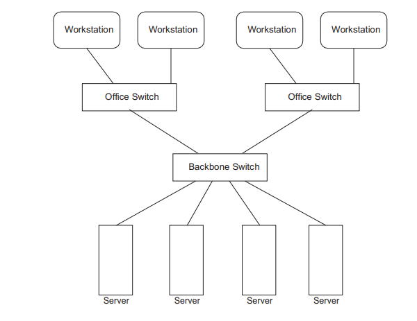
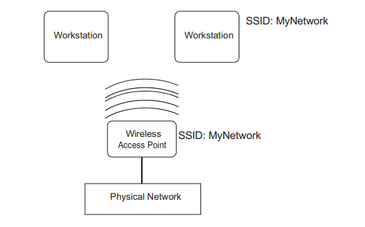

# Networking Basics

### The Physical Layer

A wired office network infrastructure

A wireless network infrastructure

### The Network Layer

Để cấu hình Linux kết nối tới hệ thống mạng, ta cần 4 phần thông tin: 

- An IP address
- A hostname
- A	default router
- A	netmask value

#### IP address

Xác định địa chỉ ip mà ta sẽ đặt cho máy

#### Netmask Address

Cấu hình netmask cho ip

#### Host Names

Xác định địa chỉ DNS 

#### Dynamic Host Configuration Protocol

Xác định cấu hình ip động cho máy

### The Transport Layer

Hai giao thức truyền tải phổ biến được sử dụng trong thế giới mạng IP: 

- Transmission	Control	Protocol (TCP)

Kiểm soát mức độ tin cậy của việc truyền dữ liệu, tất cả gói tin đều tới đích, không có gói nào bị sót hay thất lạc

- User Datagram Protocol (UDP)

Kiểm soát đường truyền được sử dụng chủ yếu để thiết lập các kết nối có độ trễ thấp và không chịu lỗi giữa các ứng dụng internet, UDP không cung cấp khả năng kiểm soát lỗi và lưu lượng. 

### The Application Layer

Một số cổng ứng dụng nổi tiếng phổ biến: 

|Port |   Protocol| Application |                     
|-----|-----------|------------|  
|20   |  TCP      |File Transfer Protocol (FTP) data|
|21   |  TCP      |File Transfer Protocol (FTP) control messages|
|22   |  TCP      |Secure Shell (SSH)|
|23   |   TCP     |Telnet interactive protocol|
|25   |  TCP      |Simple Mail Transfer Protocol (SMTP)|
|53   |  TCP&UDP  |Domain Name System (DNS)|
|80   |  TCP      |Hypertext Transfer Protocol (HTTP)|
|110  |   TCP     |Post Office Protocol version 3 (POP3)|
|123  |   UDP     |Network Time Protocol (NTP)|
|139  |   TCP     |NetBIOS Session Service|
|143  |  TCP      |Internet Message Access Protocol (IMAP)|
|161  |  UDP      |Simple Network Management Protocol (SNMP)|
|162  |   UDP     |Simple Network Management Protocol trap|
|389  |   TCP     |Lightweight Directory Access Protocol (LDAP)|
|443  |   TCP     |Hypertext Transfer Protocol (HTTPS) over TLS/SSL|
|465  |  TCP      |Authenticated SMTP (SMTPS)|
|514  |  TCP&UDP  |Remote Shell (TCP) or Syslog (UDP)|
|636  |   TCP     |Lightweight Directory Access Protocol over TLS/SSL (LDAPS)|
|993  |   TCP     |Internet Message Access Protocol over TLS/SSL (LDAPS)|
|995  |  TCP      |Post Office Protocol 3 over TLS/SSL (POP3S)|

Mỗi máy chủ linux lưu trữ 1 danh sách tên các cổng mạng của nó trong tệp `/etc/service`. Các ứng dụng có thể đọc tệp này khi làm việc với các cổng mạng và sử dụng tên thay vì số cổng. 

